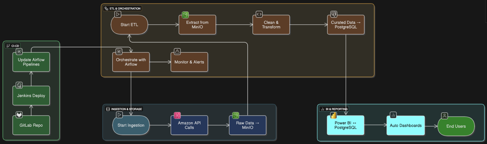

# End-to-End Data Pipeline with Airflow, MinIO, and PostgreSQL

This project demonstrates a complete data pipeline using Apache Airflow for orchestration, MinIO for object storage (as a data lake), and PostgreSQL as a data warehouse. The pipeline is containerized using Docker.

## Key Features

*   **End-to-End Pipeline:** Demonstrates a full data lifecycle from ingestion to storage and processing.
*   **Containerized with Docker:** All services are containerized with Docker for portability and easy setup.
*   **Orchestration with Airflow:** Uses Apache Airflow for robust and reliable pipeline orchestration.
*   **Data Lake and Data Warehouse:** Implements a two-tiered data storage solution with MinIO as a data lake and PostgreSQL as a data warehouse.
*   **Modular and Scalable:** The pipeline is designed to be modular and scalable, with a clear separation of concerns.

## Technologies Used

*   **Orchestration:** Apache Airflow
*   **Data Storage:** MinIO, PostgreSQL
*   **Containerization:** Docker, Docker Compose
*   **Language:** Python
*   **Libraries:** pandas, Faker

## Architecture

This project showcases a data pipeline with two distinct architectures: the **current, implemented pipeline** and the **ideal, production-ready pipeline**. This approach demonstrates both the practical implementation and the strategic vision for a comprehensive data processing system.

### Current Pipeline

The current pipeline is a functional, containerized system that forms the foundation of the project. It includes the core components for data ingestion, storage, and processing.

| ID  | Stage                        | Description                                                                                                                            | Tools Used                             |
| --- | ---------------------------- | -------------------------------------------------------------------------------------------------------------------------------------- | -------------------------------------- |
| 1.0 | Data Ingestion               | - A mock API is used to simulate data retrieval. <br> - Raw data is saved to MinIO.                                                    | - Mock API <br> - Airflow <br> - MinIO |
| 2.0 | Data Storage                 | - MinIO is set up as a Data Lake to store raw data. <br> - PostgreSQL serves as a Data Warehouse for structured, analytics-ready data. | - MinIO <br> - PostgreSQL              |
| 3.0 | ETL (Extract, Transform, Load) | - Python scripts are used to read raw data from MinIO, clean and transform it. <br> - The cleaned data is loaded into PostgreSQL.      | - Airflow <br> - Python                |
| 4.0 | Orchestration & Monitoring   | - Airflow orchestrates the entire pipeline. <br> - Airflow's UI is used for monitoring and managing the pipeline.                       | - Airflow                              |

### Ideal Pipeline



## Getting Started

### Prerequisites

- Docker
- Docker Compose

### Setup

1.  **Clone the repository:**
    ```bash
    git clone https://github.com/ptrgiang/end-to-end-pipeline.git
    cd end-to-end-pipeline
    ```

2.  **Create an environment file:**
    Create a `.env` file in the root of the project and add the following environment variables. You can change the values as you see fit.

    ```env
    # PostgreSQL
    POSTGRES_USER=airflow
    POSTGRES_PASSWORD=airflow
    POSTGRES_DB=airflow

    # MinIO
    MINIO_ROOT_USER=minioadmin
    MINIO_ROOT_PASSWORD=minioadmin

    # Airflow
    AIRFLOW_SECRET_KEY=your-super-secret-key
    ```

3.  **Build and run the containers:**
    ```bash
    docker-compose up --build
    ```

4.  **Access the services:**
    - **Airflow UI:** [http://localhost:8080](http://localhost:8080) (Login with `admin`/`admin`)
    - **MinIO UI:** [http://localhost:9001](http://localhost:9001) (Login with the `MINIO_ROOT_USER` and `MINIO_ROOT_PASSWORD` you set in the `.env` file)

## Project Structure

- `airflow/`: Contains Airflow configurations, DAGs, and plugins.
  - `dags/`: Contains all the Airflow DAGs that define the data pipelines.
    - `amazon_api_to_postgres_pipeline.py`: The main DAG that orchestrates the entire pipeline.
    - `dag_minio_postgres_pipeline_v2.py`: A more professional version of the MinIO to PostgreSQL pipeline.
    - `dag_enrich_sales_data.py`: A DAG that demonstrates data enrichment.
  - `Dockerfile`: Dockerfile for the Airflow services.
  - `requirements.txt`: Python dependencies for Airflow.
- `docker-compose.yaml`: The Docker Compose file that defines all the services, networks, and volumes.
- `.env`: Environment variables for the services (not version controlled).
- `README.md`: This file.

## Future Improvements

*   **Implement Data Quality Checks:** Add data quality checks to the pipeline to ensure the data is accurate and complete.
*   **Add a CI/CD Pipeline:** Implement a CI/CD pipeline with Jenkins or GitHub Actions to automate the testing and deployment of the project.
*   **Use a more realistic data source:** Replace the mock data generators with a real API or a database.

## License

This project is licensed under the MIT License. See the [LICENSE](LICENSE) file for details.
